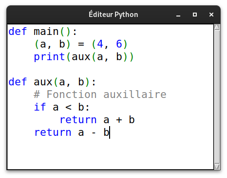
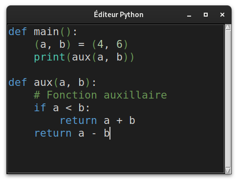

## Projet

Veuillez ouvrir la racine de projet dans vscode par exemple, puis exécuter main.py

## Captures d'écran

Voici quelques captures d'écran de l'application :

### Mode Clair

### Mode Sombre

